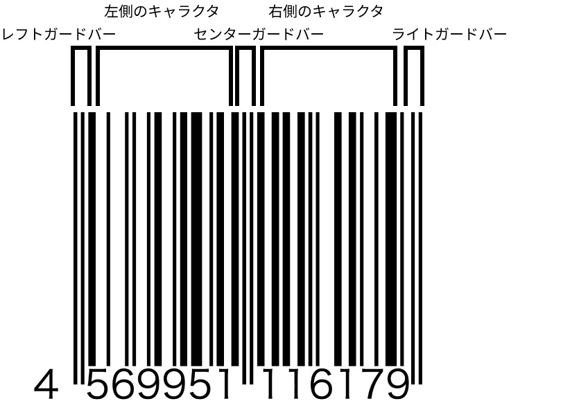
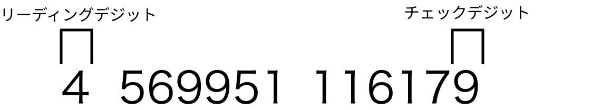

# バーコードの構成

ここでは、バーコードの基本構成を見ていきましょう。

バーコードは、主に次のように構成されています。

- レフトガードバー、センターガードバー、ライトガードバー  
  左側にレフトガードバー、真ん中にセンターガードバー、右側にライトガードバーがあります。これらは他のバーよりも高さが少し大きくなっており、左と右を仕切る役割を果たしています。
- 左側のキャラクタ、右側のキャラクタ  
  レフトガードバーとセンターガードバーの間に左側のキャラクタ、センターガードバーとライトガードバーの間に右側のキャラクタがあります。これらが、バーコードの一番重要な部分であり数字を表します。

次にバーコードが表す数字を見てみましょう。

実は、バーコードが表す数字はバーコードのすぐ下に書いてある数字です。つまり、バーコードを直接読まなくてもその下に書いてある数字を読めばバーコードを読むことができるのです。

この数字のうち、最初のものをリーディングデジットと呼び、最後のものをチェックデジットと呼びます。チェックデジットは、他の数字から計算することができ、その結果がチェックデジットと同じかを確かめることで正しくバーコードを読むことができたか確認することができます。
